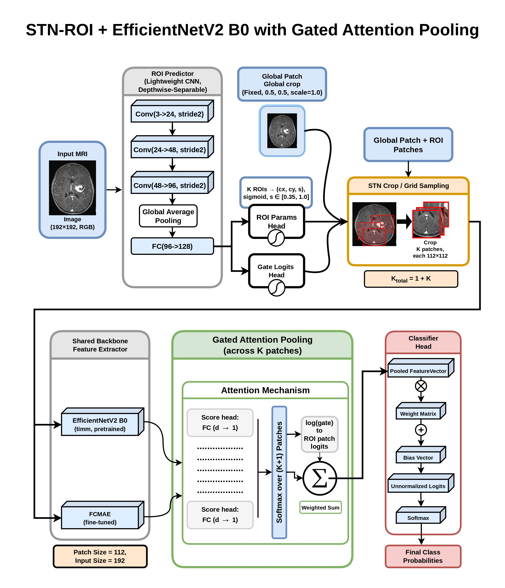
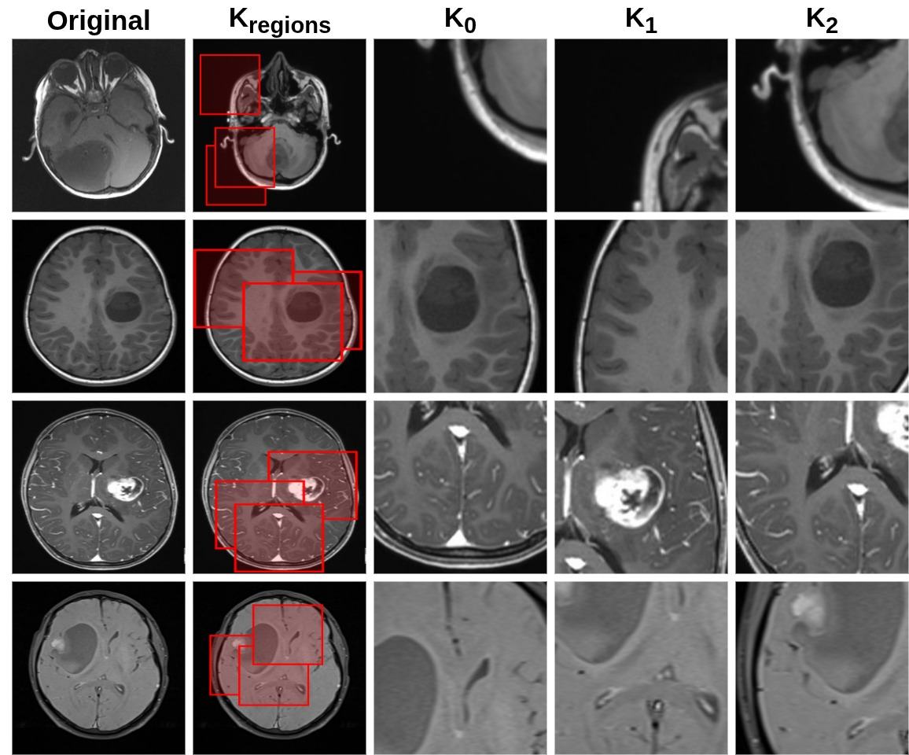
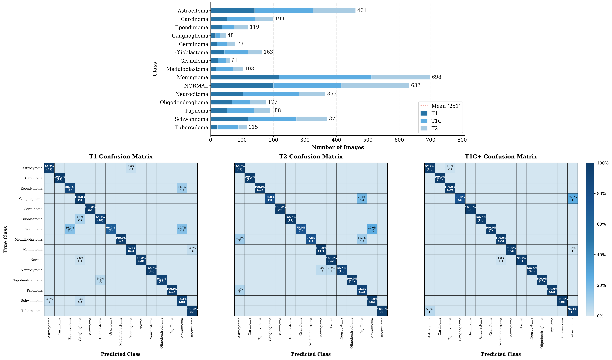
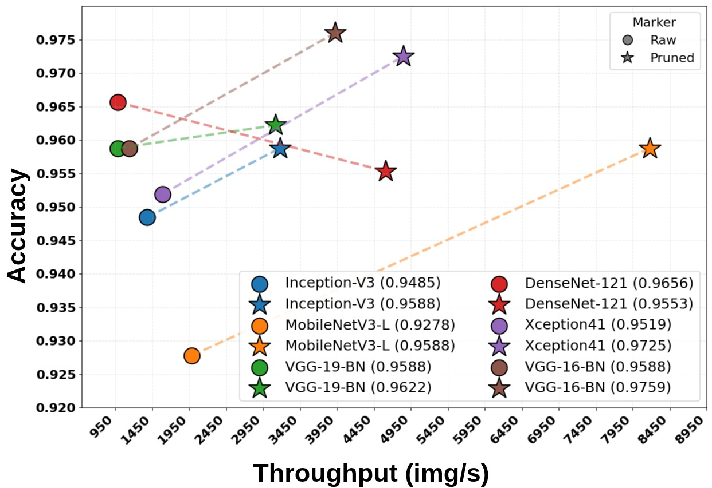
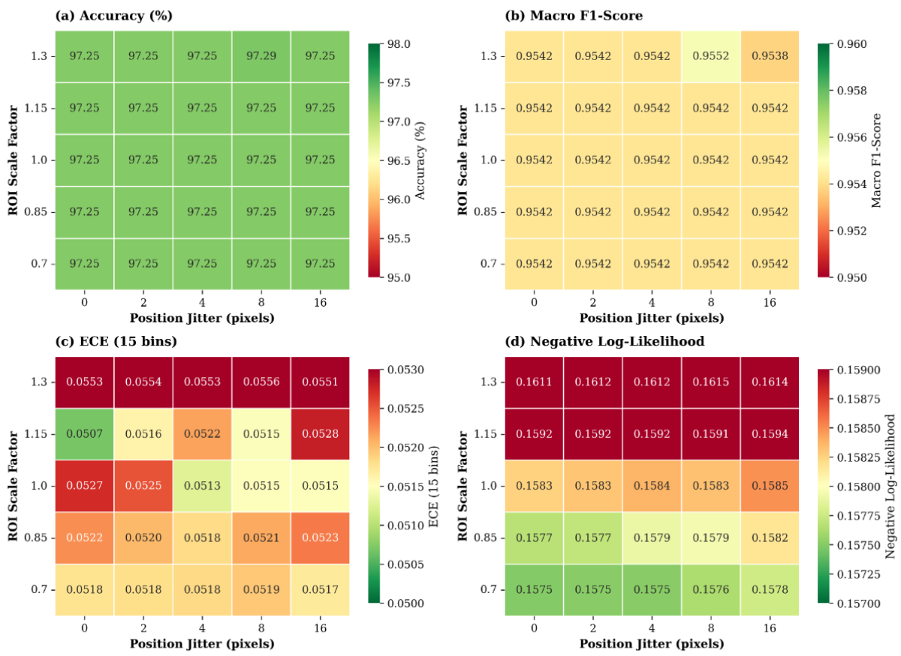
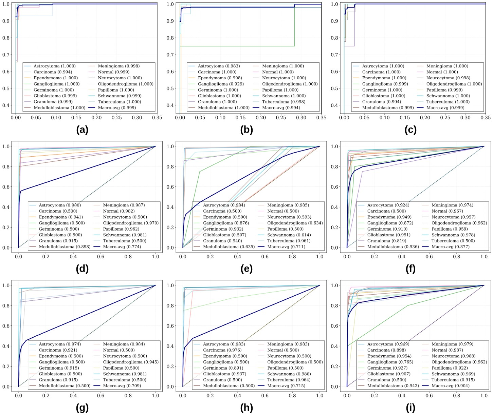

# Calibrated ROI-Gated Conditional Computation for Brain Tumor MRI Classification

<div align="center">

[](https://www.sciencedirect.com/science/article/abs/pii/S0169260726001641?via%3Dihub)
[](https://www.python.org/)
[](https://pytorch.org/)
[](LICENSE)

**High-Throughput and Backbone-Agnostic Brain Tumor MRI Classification**

*Ashraful Alam Nirob · Sakib Apon · Anika Tahsin · Md. Golam Rabiul Alam · Sandra Costanzo · Giancarlo Fortino · Mohammad Mehedi Hassan*

</div>

---

## Overview

This repository contains the official implementation of our paper on **Calibrated ROI-Gated Conditional Computation** for brain tumor MRI classification. The framework introduces a trainable, backbone-agnostic efficiency layer that reallocates computation toward diagnostically relevant spatial regions while preserving global image context and calibrated confidence reliability.

<div align="center">
  
  <br/>
  <em>Figure 1: Overview of the STN-ROI + EfficientNet-B0 framework with Gated Attention Pooling. A lightweight depthwise-separable ROI predictor estimates K ROI parameters and gate logits; all patches share a single backbone to extract features aggregated via gated attention.</em>
</div>

---

## Key Results at a Glance

| Metric | Value |
|---|---|
| Throughput Gain (vs. best accuracy baseline) | **2.3× – 5.7×** |
| Accuracy (T1, proposed) | 0.961 ± 0.004 |
| Accuracy (T1C+, proposed) | **0.980 ± 0.009** (best overall) |
| Accuracy (T2, proposed) | 0.951 ± 0.021 |
| ECE (with calibration) | 0.0100 |
| ECE (without calibration) | 0.0535 |

---

## Core Contributions

- **Trainable backbone-agnostic ROI-guided framework** that always retains a global crop while learning K candidate ROIs per image via differentiable grid-sampling (STN).
- **Differentiable gating-and-aggregation** that prioritizes lesion-relevant evidence while preserving global context, enabling consistent training-to-inference behavior.
- **Concrete (Gumbel–Sigmoid) ROI gating** with an expected ROI-count regularizer targeting a user-specified compute budget, and hard top-K_max pruning at inference (including a global-only path when K_max = 0).
- **Differentiable Soft-ECE calibration constraint** that maintains reliable probability estimates under conditional computation.
- **2.3×–5.7× throughput gains** with no statistically significant accuracy penalty (p > 0.05), and statistically decisive efficiency gains (p < 0.001), across T1, T1C+, and T2 modalities.

---

## Architecture

<div align="center">
  
  <br/>
  <em>Figure 2: Progressive refinement of ROI selection during training. As training proceeds, selected regions become more consistent and increasingly concentrate on clinically relevant tumor areas.</em>
</div>

### How It Works

The framework operates as a content-adaptive inference engine in three stages:

1. **ROI Prediction** — A lightweight depthwise-separable CNN predicts K crop parameters `(cx, cy, s)` and gate logits for each input image.
2. **STN Cropping + Shared Backbone** — Both the fixed global crop and K ROI crops are extracted via differentiable grid sampling and encoded by a single shared backbone (EfficientNet-B0 by default).
3. **Gated Attention Pooling + Classification** — Gate-modulated attention aggregates global and ROI features into a pooled representation for final classification.

Training jointly optimizes:
- **Cross-entropy loss** (classification)
- **Budget regularizer** (compute control via expected ROI count)
- **Soft-ECE penalty** (calibration-aware constraint)

At inference, the pruned mode processes only the global crop and top-K selected ROIs, with optional thresholding.

---

## Datasets

The framework was evaluated on a harmonized multi-source corpus of brain tumor MRI images.

| Source | MRI Type | Classes | Images | Role |
|---|---|---|---|---|
| [Fernando Feltrin](https://www.kaggle.com/datasets/fernando2rad/brain-tumor-mri-images-44c) | T1, T1C+, T2 | 15 classes | 4,479 | Primary dataset |
| [Nickparvar](https://www.kaggle.com/datasets/masoudnickparvar/brain-tumor-mri-dataset) | Brain MRI | 4 classes | 7,022 | Label-harmonized addition |
| [BRISC](https://figshare.com/articles/dataset/_b_BRISC_Annotated_Dataset_for_Brain_Tumor_Segmentation_and_Classification_b_/30533120) | T1 | 4 classes | 6,000 | Classification images only |

**15 tumor classes:** Normal, Astrocytoma, Carcinoma, Ependymoma, Ganglioglioma, Germinoma, Glioblastoma, Granuloma, Medulloblastoma, Meningioma, Neurocytoma, Oligodendroglioma, Papilloma, Schwannoma, Tuberculoma.

<div align="center">
  
  <br/>
  <em>Figure 3: Class distribution across modalities and modality-wise row-normalized confusion matrices.</em>
</div>

---

## Installation

```bash
# Clone the repository
git clone https://github.com/Ashraful-Alam-Nirob/Backbone-Agnostic-ROI-Inference.git
cd Backbone-Agnostic-ROI-Inference

# Create a virtual environment (recommended)
python -m venv venv
source venv/bin/activate   # Linux/Mac
# venv\Scripts\activate   # Windows

# Install dependencies
pip install torch torchvision timm scikit-learn numpy optuna
```

**Requirements:**
- Python ≥ 3.8
- PyTorch ≥ 2.0
- CUDA-capable GPU (tested on NVIDIA RTX 3080)
- `timm`, `scikit-learn`, `numpy`, `optuna`

---

## Data Preparation

Organize your dataset into the following structure before training:

```
data_split/
├── train/
│   └── MRI/
│       ├── Astrocytoma/
│       ├── Carcinoma/
│       ├── ...
│       └── Normal/
└── val/
    └── MRI/
        ├── Astrocytoma/
        ├── ...
        └── Normal/
```

Update the paths at the top of `proposed_framework.py`:

```python
train_dir = "/path/to/data_split/train/MRI"
val_dir   = "/path/to/data_split/val/MRI"
CKPT_SAVE_PATH = "/path/to/checkpoints/model.pth"
```

---

## Usage

### Training

```bash
python proposed_framework.py
```

The script runs a two-stage training procedure:
- **Stage 1** (20 epochs): Warm-up with frozen backbone.
- **Stage 2** (remaining epochs): Full end-to-end training with EMA, MixUp, and calibration-aware loss.

The best checkpoint (by validation accuracy) is saved automatically.

### Hyperparameter Tuning (Optuna)

A multi-objective Optuna tuning loop is included to jointly optimize accuracy, throughput, and calibration:

```bash
python proposed_framework.py --tune
```

This runs a TPE-sampler study maximizing `(accuracy, throughput)` and minimizing `(ECE, NLL, Brier)`.

### Key Configuration Options

| Parameter | Default | Description |
|---|---|---|
| `BACKBONE_NAME` | `convnextv2_tiny.fcmae_ft_in22k_in1k` | `timm` backbone identifier |
| `K_rois` | `4` | Number of learnable ROI crops |
| `Kmax_infer` | `0` | Max ROIs at inference (0 = global-only, fastest) |
| `tau_infer` | `0.768` | Gate retention threshold at inference |
| `target_K` | `0.93` | Expected ROI count target for budget regularizer |
| `ece_weight` | `0.02` | Weight of Soft-ECE calibration loss |
| `epochs` | `120` | Total training epochs |
| `image_size` | `192` | Input image resolution |
| `patch_size` | `112` | ROI crop size |

---

## Quantitative Results

### T1-Weighted MRI

| Model | Acc ↑ | F1-macro ↑ | ECE15 ↓ | ms/img ↓ | img/s ↑ |
|---|---|---|---|---|---|
| DenseNet-121 | 0.964 ± 0.002 | 0.950 ± 0.008 | 0.036 ± 0.021 | 1.099 | 913.1 |
| EfficientNet-B0 | 0.958 ± 0.002 | 0.934 ± 0.005 | 0.033 ± 0.002 | 0.659 | 1526.3 |
| ConvNeXtV2-Atto | 0.921 ± 0.012 | 0.876 ± 0.017 | 0.033 ± 0.004 | 0.495 | 2022.5 |
| **Proposed** | **0.961 ± 0.004** | **0.939 ± 0.004** | 0.037 ± 0.017 | **0.193** | **5189.0** |

### T1C+ (Contrast-Enhanced) MRI

| Model | Acc ↑ | F1-macro ↑ | ECE15 ↓ | ms/img ↓ | img/s ↑ |
|---|---|---|---|---|---|
| DenseNet-121 | 0.961 ± 0.003 | 0.937 ± 0.006 | 0.017 ± 0.006 | 1.448 | 694.9 |
| EfficientNet-B0 | 0.975 ± 0.004 | 0.957 ± 0.003 | 0.016 ± 0.004 | 0.813 | 1231.7 |
| ConvNeXtV2-Atto | 0.948 ± 0.008 | 0.898 ± 0.015 | 0.021 ± 0.004 | 0.572 | 1753.0 |
| **Proposed** | **0.980 ± 0.009** | **0.962 ± 0.016** | 0.035 ± 0.008 | **0.198** | **5065.1** |

### T2-Weighted MRI

| Model | Acc ↑ | F1-macro ↑ | ECE15 ↓ | ms/img ↓ | img/s ↑ |
|---|---|---|---|---|---|
| DenseNet-121 | 0.908 ± 0.004 | 0.882 ± 0.009 | 0.042 ± 0.020 | 1.261 | 794.3 |
| EfficientNet-B0 | 0.927 ± 0.007 | 0.899 ± 0.011 | 0.043 ± 0.009 | 0.767 | 1303.4 |
| ConvNeXtV2-Atto | 0.862 ± 0.010 | 0.801 ± 0.027 | 0.040 ± 0.003 | 0.523 | 1913.2 |
| **Proposed** | **0.951 ± 0.021** | **0.937 ± 0.020** | **0.002 ± 0.001** | **0.063** | **5206.9** |

> All results averaged over 3 random seeds (0, 24, 48). Inference benchmarked on NVIDIA RTX 3080, batch size = 16.

### Backbone-Agnostic Efficiency Gains (T1 setting)

<div align="center">
  
  <br/>
  <em>Figure 4: Accuracy–throughput trade-off across SOTA backbones. Circles = raw models; stars = same backbone with proposed framework. Dashed lines highlight the consistent rightward (throughput) shift.</em>
</div>

---

## ROI Robustness

<div align="center">
  
  <br/>
  <em>Figure 5: Performance stability under controlled ROI scale (0.70×–1.30×) and center jitter (0–16 px). Accuracy and Macro-F1 remain nearly constant; ECE and NLL show only minor variation.</em>
</div>

---

## Multi-Source External Evaluation

| Variant | Acc ↑ | F1-macro ↑ | ECE15 ↓ | img/s ↑ |
|---|---|---|---|---|
| DenseNet-121 | 0.998 ± 0.001 | 0.998 ± 0.001 | 0.002 ± 0.001 | 1419.1 |
| EfficientNet-B0 | 0.997 ± 0.001 | 0.997 ± 0.001 | 0.004 ± 0.001 | 2215.5 |
| ConvNeXtV2-Atto | 0.995 ± 0.000 | 0.995 ± 0.000 | 0.005 ± 0.000 | 2781.7 |
| **Proposed (Pruned, calib.)** | **0.9935 ± 0.0026** | **0.9935 ± 0.0026** | 0.0023 ± 0.0012 | **15899.5** |

Evaluated on the harmonized Nickparvar + BRISC external corpus (≈5.72× faster than the fastest baseline; ≈11.20× vs. the best-accuracy baseline).

---

## ROC Curves

<div align="center">
  
  <br/>
  <em>Figure 6: Multi-class one-vs-rest ROC curves across MRI modalities (columns: T1, T1C+, T2) and backbones (rows: EfficientNet-B0, Xception41, DenseNet-121).</em>
</div>

---

## Repository Structure

```
Backbone-Agnostic-ROI-Inference/
├── proposed_framework.py      # Main model, training, and evaluation code
├── figures/                   # Paper figures and visualizations
│   ├── framework_overview.png
│   ├── roi_refinement.png
│   ├── class_distribution.png
│   ├── accuracy_throughput_tradeoff.png
│   ├── roi_robustness.png
│   └── roc_curves.png
├── checkpoints/               # Saved model checkpoints (created at runtime)
├── data_split/                # Dataset directories (user-provided)
│   ├── train/
│   └── val/
└── README.md
```

---

## Hardware & Benchmarking Setup

All efficiency results were measured under a fixed, controlled protocol:

- **GPU:** NVIDIA RTX 3080
- **CPU:** AMD Ryzen 5 5600G
- **RAM:** 16 GB DDR4
- **Batch size:** 16 (inference)
- **Data loaders:** 4 workers, pinned memory
- **Warm-up:** 10 batches before timing
- **CNN backbones:** 192×192 input; ViT backbones at native resolution

---

## Citation

If you find this work useful, please cite our paper:

```bibtex
@article{NIROB2026109409,
title = {Calibrated ROI-gated conditional computation for high-throughput and backbone-agnostic brain tumor MRI classification},
journal = {Computer Methods and Programs in Biomedicine},
pages = {109409},
year = {2026},
issn = {0169-2607},
doi = {https://doi.org/10.1016/j.cmpb.2026.109409},
url = {https://www.sciencedirect.com/science/article/pii/S0169260726001641},
author = {Ashraful Alam Nirob and Sakib Apon and Anika Tahsin and Md. Golam Rabiul Alam and Sandra Costanzo and Giancarlo Fortino and Andrea Aliverti and Mohammad Mehedi Hassan}
}
```

---

## Acknowledgements

This work was funded by King Saud University, Riyadh, Saudi Arabia through the Ongoing Research Funding Program (ORF-2026-18). Authors Fortino and Costanzo are partially supported by the POS RADIOAMICA project funded by the Italian Ministry of Health (CUP: H53C2200065000).

---

## License

This project is released under the [MIT License](LICENSE).
